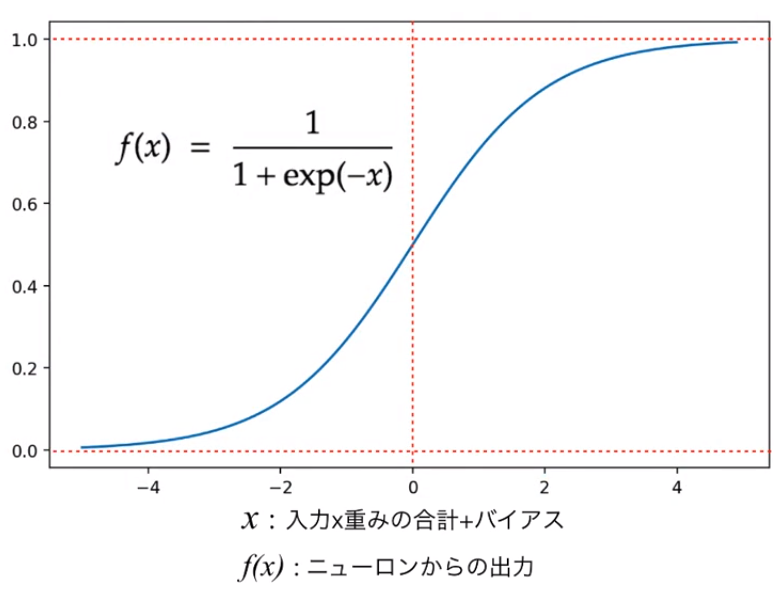

# **シグモイド関数ってなんだっけ？**

---

## はじめに

機械学習／深層学習の文脈で登場する**活性化関数**（activation function）のうち、最も古典的かつ初歩的なものとして**シグモイド関数**が存在するが、そもそもこれがどのようなものであるかという点に焦点があたることは少なく、初学者向けの書籍などにおいてもある種の「おまじない」として詳細な説明がなされないことが多いように見受けられる。

そこで本資料ではシグモイド関数に着目し、そもそも学習の過程において活性化関数を使用する意味、シグモイド関数の性質、シグモイド関数はどこから来たのか、といったポイントについておさらいする。

---

## なぜ活性化関数を使用する必要があるのか？

**ニューラル・ネットワーク**（neural network）の順伝播過程では、NWの各層を構成する個々のユニット（ニューロンをモデル化したもの）は、前の層の各ユニットが出力した値をまとめたベクトルを入力とし、それに対して重み＆バイアスとの線型和を計算し、それに対して更に非線型活性化関数を適用した結果を出力とする。

そもそもニューラル・ネットワークを含む機械学習モデルの目的は、ある入力に対しある出力を決定する「**真の関数**」（例：与えられた犬の画像から、正しく犬種を判定する分類器関数）をよく近似するモデルを得ることである。

したがって、近似したい「真の関数」が複雑である場合は、単に線型和を繋いでいくだけでなく、出力を非線型変換する作用を持つ活性化関数を各ユニットで使用することでモデルの柔軟性・表現力を高める工夫が重要となる。（シンプルに言うと、直線の傾きをどんなに調整しても、複雑な曲線に近づけることはできない、ということ）

---

## シグモイド関数とは？

活性化関数の例として、双曲線正接関数$tanh$、正規化線形関数$ReLU$などが挙げられるが、その中でも最も古典的かつ初歩的なものとして**シグモイド関数**が存在する。
シグモイド関数は、$f(x) = \frac{1}{1+\exp(-x)}$と定義される。

また、その他にも以下の性質が挙げられる。（それぞれの証明は割愛する）

* **連続的に微分可能**であり、導関数は$f'(x) = (1-f(x))f(x)$である。
  そのため、モデルの学習過程で実行される**誤差逆伝播法**と相性が良い。
  ただし、NWの階層が深くなると**勾配消失**が発生する危険性がある。
* 定義域は$(-\infin, \infin)$で、値域は$(0, 1)$をとる。
* 単調増加関数であり、正の数$a$について$f(x+a) > f(x)$の関係が成り立つ。

---

## グラフ

---

## シグモイド関数はどこから来たのか？(1/2)

対数オッズを関数と見なした$f(p) = \ln\frac{p}{1-p}$を**ロジット関数**と呼ぶ。
そのロジット関数の逆関数をとると、シグモイド関数が得られる。

* 確率$p$で起こる事象$A$について、$A$が起こる確率$p$と起こらない確率$1-p$の比$\frac{p}{1-p}$を**オッズ**と呼び、その対数をとったもの$\ln\frac{p}{1-p}$を**対数オッズ**と呼ぶ。

* 即ち、この文脈においてシグモイド関数は、「対数オッズから確率を計算する
  関数」と見なせる。

---

## シグモイド関数はどこから来たのか？(2/2)

生物の個体数の時間変化を表す微分方程式である**ロジスティック方程式**
$\frac{dN}{dt} = rN(1-\frac{N}{K})$の解$N(t) = \frac{N_0Ke^{rt}}{K-N_0+N_0e^{rt}}$に対し、$K=1$,
$N_0=0.5$, $r=1$と置いた場合でも、同様にシグモイド関数が得られる。

各パラメータは、以下の通り。

* $N$：ある時点の生物の個体数（$N_0$は個体数の初期状態）
* $t$：時間ステップ
* $r$：個体数の自然増加率
* $K$：環境収容力（環境内に存在できる個体数に制約を課すための定数）

---

## まとめ

* シグモイド関数を含む活性化関数は、ニューラル・ネットワークが複雑な関数を近似できるような強力な表現力を持つために重要な役割を果たす。
* シグモイド関数は連続的に微分可能であり、誤差逆伝播法との相性が良い。
* シグモイド関数はロジット関数（対数オッズ）の逆関数、あるいは、ロジスティック方程式（生物の個体数の時間変化）に特定のパラメータを指定した場合である。
* 機械学習／深層学習の書籍においてはそこまで深掘りされないシグモイド関数も、本資料に挙げたような性質や背景を持っている。機械学習モデルを構築する際は、個々の構成要素にまで目を向けて、性質や背景を理解して使うようにしよう！
